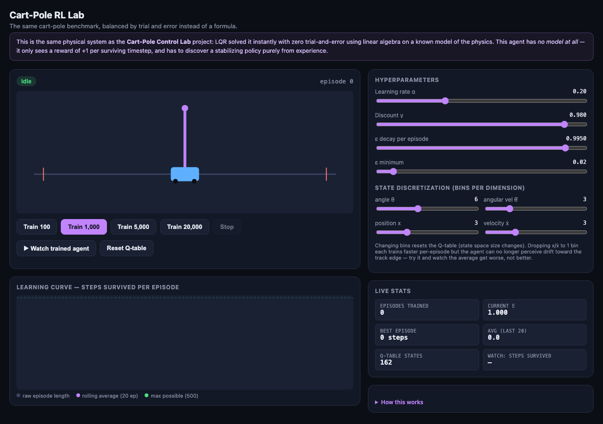
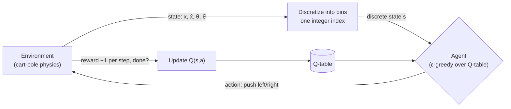
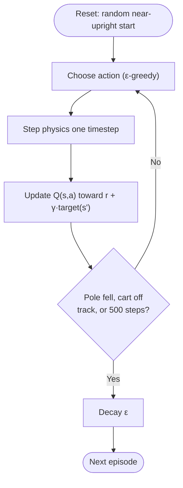
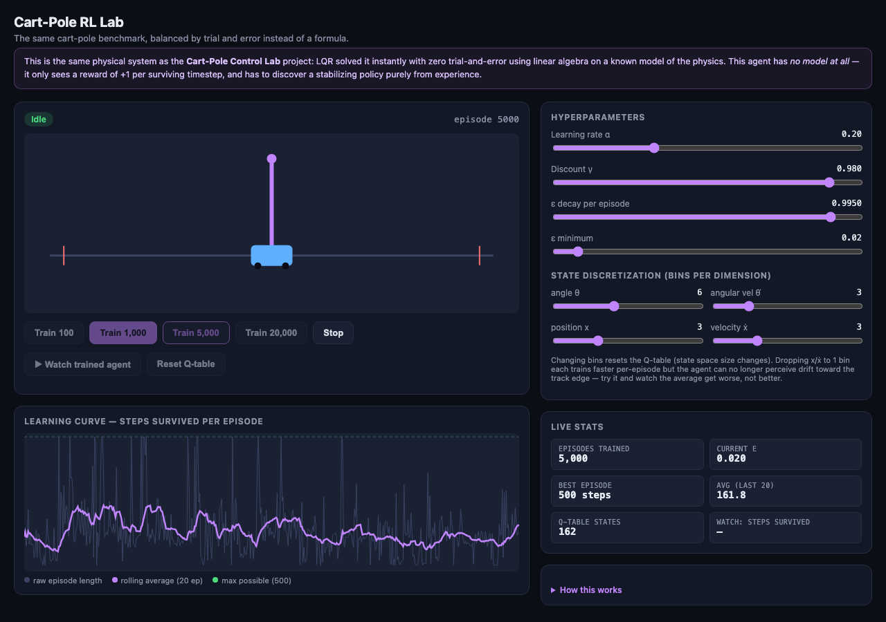
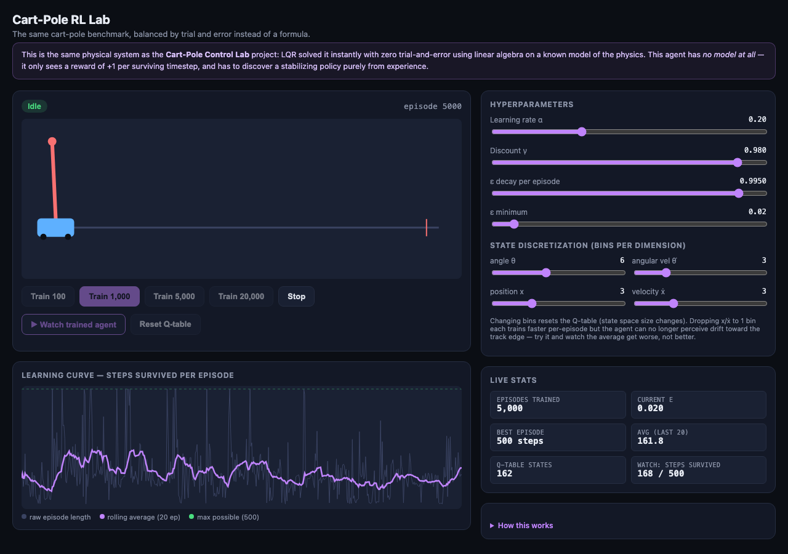
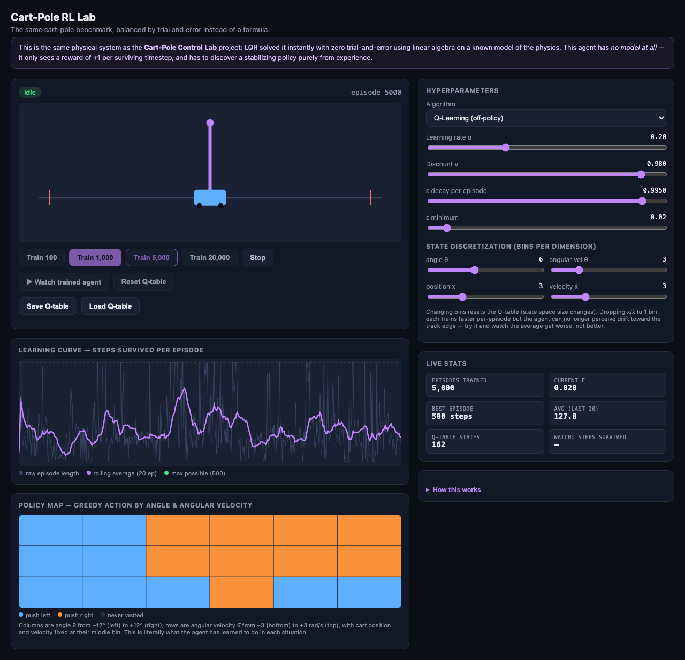
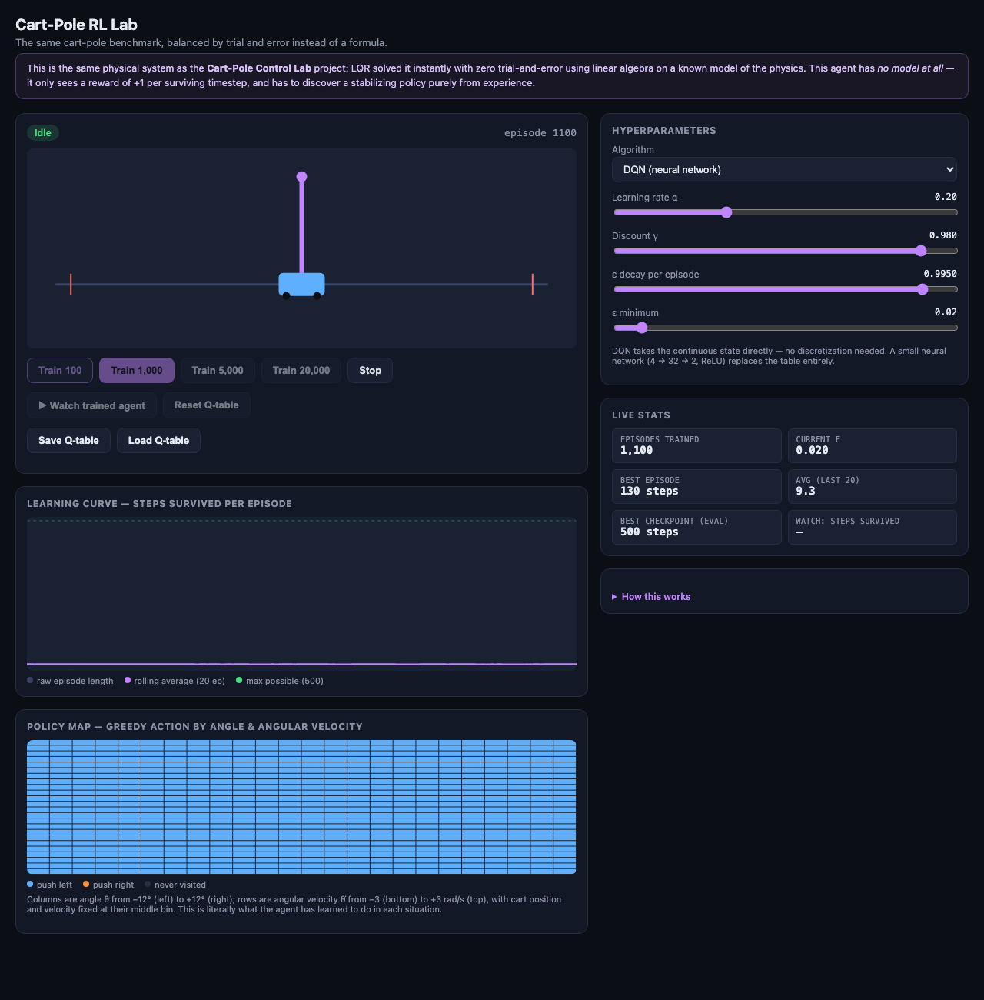

# Cart-Pole RL Lab

The same cart-pole balancing problem as [cartpole-control](../cartpole-control) — but this time nothing is told how the physics works. Three learning algorithms — tabular **Q-learning**, tabular **SARSA**, and a small hand-rolled neural network (**DQN**) — start knowing nothing and have to discover a balancing policy purely from trial and error, guided by nothing more than +1 reward per surviving timestep.

No install, no build step, no dependencies. It's a single HTML file — open it and it runs.



## How the pieces fit together

The classic reinforcement-learning agent/environment loop, with the one extra step a tabular method needs — turning a continuous state into a finite table index:



One training episode, end to end:



## Quick start

1. Download or clone this repo.
2. Open `index.html` in any modern browser.
3. Click **Train 1,000** and watch the episode counter climb and the learning curve start to trend upward.
4. When training finishes, click **▶ Watch trained agent** to see the current policy attempt a live balancing run.

## Step by step

### 1. Train the agent

The environment matches the classic **CartPole-v1** benchmark exactly: cart mass 1.0 kg, pole mass 0.1 kg, pole half-length 0.5 m, ±10 N bang-bang force, 0.02 s timestep. An episode ends when the cart leaves ±2.4 m or the pole tips past ±12°, and reward is +1 per surviving step, capped at 500.

Click **Train 100**, **Train 1,000**, **Train 5,000**, or **Train 20,000** to run that many episodes back-to-back. Training is chunked so the UI stays responsive — you'll see the episode counter, current ε (exploration rate), best episode, and rolling average all update live as it goes, along with the learning curve chart.

Because the agent can't perceive the world continuously, its 4-dimensional state (position, velocity, angle, angular velocity) is discretized into bins — adjustable under **State Discretization**. More bins per dimension means finer perception but a larger table to fill in, so it can need *more* training, not less, to reach the same performance.



The raw episode length (thin grey line) is noisy — that's expected, since ε-greedy exploration keeps taking random actions even late in training. The rolling average (purple) is the line to watch; it should trend upward over thousands of episodes.

### 2. Watch it balance

Click **▶ Watch trained agent** to run one real-time episode using the agent's current best-known policy (no exploration — pure greedy action selection). The pole and cart render live, just like the control-systems project, so you can watch it either recover nicely or fall over, depending on how much training it's had.



### 3. Look at the policy map

Below the learning curve, the **Policy Map** shows exactly what the agent has learned: for cart position and velocity held at their middle bin, it colors every angle/angular-velocity combination by which action (push left or push right) the agent currently prefers there. Early on it's mostly dark (unvisited); after a few thousand episodes it resolves into a clean pattern — a diagonal-ish split from "push left" when tilted left to "push right" when tilted right, which is roughly the same bang-bang heuristic an engineer would hand-design.



### 4. Compare Q-learning against SARSA

The **Algorithm** dropdown switches between update rules (switching resets the current agent for a fair comparison):

- **Q-learning** (off-policy) always bootstraps off the best action it currently believes is available next, regardless of whether ε-greedy exploration will actually take it.
- **SARSA** (on-policy) bootstraps off whatever action it actually selects next — including random exploratory moves — so it learns the value of the policy it's really following, exploration and all, and tends to come out a bit more conservative.

Train the same episode budget under each and compare the learning curves and final policy maps.

### 5. Try DQN — and watch it destabilize

Switch **Algorithm** to **DQN**. The state discretization panel disappears (DQN takes the raw continuous state directly — no bins, no lost information at the track edges) and a small neural network takes over: 4 inputs → 32 hidden units (ReLU) → 2 output Q-values, trained with experience replay, a target network, and Double DQN — the standard modern stabilization stack, all hand-rolled with manual backpropagation, no libraries.

Train a few thousand episodes and watch the **live** episode length and the **Best checkpoint (eval)** stat side by side:



It's common to see the live average crash back down after the agent has already found a great policy — this is a real, well-documented instability in value-based deep RL, not a bug in this implementation (Double DQN, experience replay, and a target network all help, but don't eliminate it). That's exactly why the app evaluates the greedy policy every 25 episodes and keeps a snapshot whenever it improves: **Watch trained agent** always uses that saved best network, not whatever the live one currently is. Click Watch after a training run where the live average looks terrible — it'll very likely still balance perfectly.

### 6. Save and reload progress

**Save Q-table** stores the current table, bin configuration, and stats in your browser's local storage; **Load Q-table** restores them, even after a page reload. Handy for picking up a long training run later, or for saving a good policy before experimenting with settings you might want to undo.

### 7. Break it on purpose

Try this to feel the effect of state representation on what's learnable at all:

- Drop the **position x** and **velocity ẋ** bins down to 1 each and retrain from scratch (**Reset Q-table**, then train again). The agent can no longer perceive drift toward the track edge at all — watch the average *get worse*, not better, no matter how long you train. This isn't a slower learner; it's an agent that's blind to information it needs.
- Compare the number of episodes this takes to reach a decent policy against how instantly [cartpole-control](../cartpole-control)'s LQR controller solves the identical physical system with a few matrix operations. That gap — thousands of trial-and-error episodes versus one closed-form linear-algebra solve — is the real, practical cost of not having a model of your environment.

### 8. Tune the learning itself

- **α (learning rate)** — how much each new experience overwrites the old estimate. Too high and learning is noisy; too low and it's painfully slow.
- **γ (discount)** — how much future reward matters relative to immediate reward.
- **ε decay** — how quickly the agent shifts from exploring randomly to exploiting what it's learned.

## How it works, in detail

### Environment

The exact same verified nonlinear cart-pole RK4 simulation as the control-systems project (`derivatives` / `rk4Step`), just driven by two discrete actions (`+10N` / `−10N`) instead of a continuous force, matching the classic **CartPole-v1** benchmark's parameters exactly (cart mass 1.0 kg, pole mass 0.1 kg, pole half-length 0.5 m, 0.02s timestep, ±2.4m / ±12° failure bounds, reward +1/step capped at 500).

### Discretization

A lookup table needs a finite number of rows, so each continuous state variable is binned:

```
index(v, lo, hi, n) = clamp(floor((v − lo) / (hi − lo) · n), 0, n−1)
box(x, ẋ, θ, θ̇) = ((ix·n_ẋ + iẋ)·n_θ + iθ)·n_θ̇ + iθ̇
```

The four bin-count sliders directly set the table size — `n_x · n_ẋ · n_θ · n_θ̇ · 2 actions` total entries — this is the same "boxes" idea from the classic Barto–Sutton–Anderson (1983) cart-pole paper, the origin of tabular cart-pole control.

### Update rules

Both maintain a table `Q(s, a)` estimating expected future reward for taking action `a` in discretized state `s`, updated after every step:

```
Q-learning (off-policy):  Q(s,a) += α · ( r + γ · max_a' Q(s',a')  − Q(s,a) )
SARSA (on-policy):        Q(s,a) += α · ( r + γ · Q(s', a'_actual) − Q(s,a) )
```

The difference is subtle but real: Q-learning always bootstraps off the **best** action it currently believes is available next — even though ε-greedy exploration means it won't always actually take it — so it's learning the value of the *optimal* policy while behaving semi-randomly. SARSA bootstraps off whatever action it **actually** selects next (chosen ε-greedily, before the update happens), so it's learning the value of the policy it's really following, exploration and all. In environments with a real risk of a costly mistake, this usually makes SARSA converge to a slightly more conservative policy than Q-learning.

Action selection is ε-greedy: `random < ε` picks a uniformly random action, otherwise the action with the higher `Q(s,·)`. `ε` starts at 1.0 (always explore) and decays multiplicatively every episode toward a small floor, so exploration is heavy early and rare late.

### DQN

Replaces the table with a function approximator: a tiny multilayer perceptron, `4 inputs → 32 hidden (ReLU) → 2 outputs (Q-values)`, with every weight and the full forward/backward pass hand-written (no autodiff library — this project keeps the "no dependencies" rule even here). Three standard stabilization techniques are layered on top of the basic idea, because naive online DQN on this problem is visibly unstable without them:

- **Experience replay** — every transition `(s, a, r, s', done)` goes into a fixed-size circular buffer; each training step samples a random minibatch from it instead of training only on the most recent (highly correlated) transition.
- **Target network** — a second copy of the network, frozen for a stretch of steps, supplies the `max`/bootstrapped value in the training target, so the network isn't chasing a target that moves every time it updates.
- **Double DQN** — the *online* network picks which next action looks best, but the *target* network supplies that action's value: `target = r + γ · Q_target(s', argmax_a Q_online(s', a))`. This specifically corrects a known overestimation bias in vanilla DQN (Q-learning's `max` operator tends to systematically overestimate values under function approximation).

Even with all three, training is genuinely less stable than the tabular case — in testing, this exact setup could reach a perfect 500-step policy by episode ~500 and then destabilize back down to single digits by episode ~1000, entirely from continued training on its own (by-then very repetitive) replay buffer. Rather than fight that instability away entirely (a deep, still-active area of RL research), the app works with it honestly: it evaluates the greedy policy every 25 episodes with 3 short deterministic rollouts, and keeps a full snapshot of the network whenever that evaluation score improves. **Watch trained agent** always loads that saved snapshot, not the live network — so a good policy found mid-training is never lost even if training continues past it.

### Policy map

For Q-learning/SARSA, a direct visualization of the Q-table: for cart position and velocity fixed at their middle bin, every `(θ, θ̇)` cell is colored by `argmax` over its two action values. DQN has no table to read, so the same picture is built by sampling a 24×24 grid of `(θ, θ̇)` points (position/velocity fixed at exactly 0) and running each one through the network's forward pass — same visualization, different data source.

### Save/load

The current agent's state round-trips through `localStorage` as JSON under one key: for Q-learning/SARSA that's the table and bin configuration; for DQN it's all three network snapshots (online, target, and best-checkpoint) plus its evaluation score — alongside the shared training stats (episode count, ε, learning curve history) either way.

### Code layout

Everything lives in `index.html` with no external dependencies. Top-to-bottom: `Physics → Environment (reset/step) → Discretization → DQN network & training loop → Q-table & training loop → Chart rendering → Policy heatmap → Watch-mode rendering → Save/load → UI wiring`.

## Related projects

- **[cartpole-control](../cartpole-control)** — the same system, solved instantly with PID and LQR instead of learned by trial and error.
- **[game-theory-lab](../game-theory-lab)** — the Iterated Prisoner's Dilemma and evolutionary game theory.
